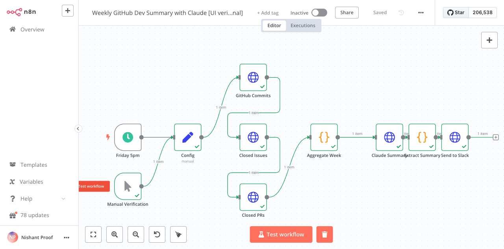

# Real n8n execution evidence

- Date: 2026-10-03
- n8n: 1.82.3 (Docker)
- Result: successful end-to-end execution through `Send to Slack`
- CLI verification: exit code 0
- Live dependency: public GitHub API
- Verification transports: local deterministic Anthropic and Slack endpoints (no external credentials were available on the verification host)

## Observed Anthropic request

- model: `claude-sonnet-4-20250514`
- `max_tokens`: `1200`
- language: `EN`
- prompt included only the aggregated GitHub week data

## Observed Slack delivery

The final Slack verification endpoint received the normalized Claude summary text after `Extract Summary`, proving the Claude response was parsed and forwarded rather than falling back to a placeholder.

## Screenshot

The production workflow still defaults to `https://api.anthropic.com/v1/messages` and the configured `SLACK_WEBHOOK_URL`; the local endpoints were used only to provide reproducible credential-free execution evidence.
